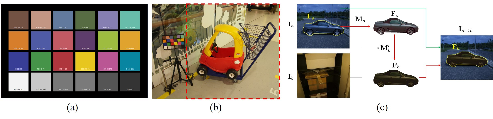
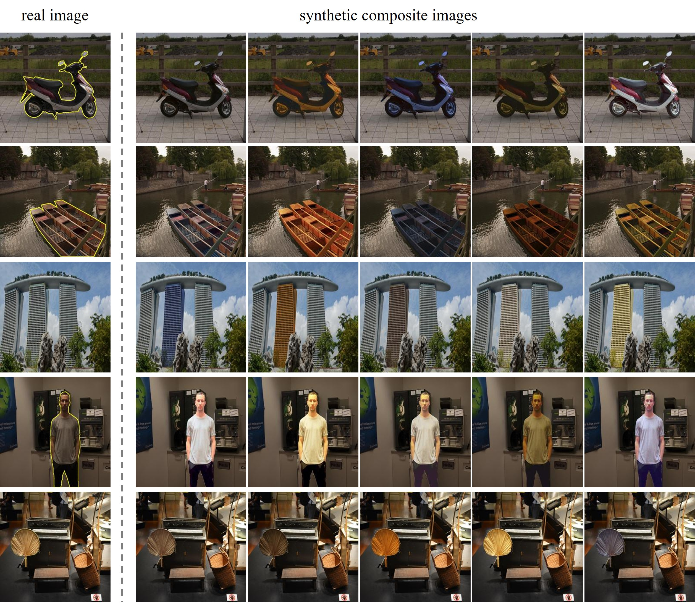

# Image-Harmonization-Dataset-ccHarmony

## Overview

**Image Harmonization** is to harmonize a composite image by adjusting its foreground appearances consistent with the background region. A real composite image is generated by a foreground region of one image combined with the background of another image. Though it's easy to create real composite images, the harmonized outputs are too time-consuming and skill-demanding to generate. 

Our dataset **ccHarmony** is a color checker (cc) based image harmonization dataset. In previous datasets like [NUS dataset](https://cvil.eecs.yorku.ca/projects/public_html/illuminant/illuminant.html) and [Gehler dataset](https://www2.cs.sfu.ca/~colour/data/shi_gehler/), images are captured with a color checker placed in the scene that provides ground truth reference for illumination estimation, as shown in (a) and (b) in the figure below. Based on these datasets, we design a novel transitive way to construct image harmonization dataset (see (c) in the figure below). Specifically, we convert the foreground in a real image to the standard illumination condition, and then convert it to another illumination condition, arriving at a synthetic composite image. In this way, we obtain 4260 pairs of synthetic composite images and ground-truth real images. More details can be found in our research paper. 

## Research Paper

 Haoxu Huang, Li Niu: "*ccHarmony: Color-checker based Image Harmonization Dataset*." arXiv preprint arXiv:2206.00800 (2022) [[pdf]](https://arxiv.org/pdf/2206.00800.pdf) 

## Dataset

Our dataset contains 350 real images and 426 segmented foregrounds, in which each real image has one or two segmented foregrounds. Each foreground is associated with 10 synthetic composite images. Therefore, our dataset has in total 4260 pairs of synthetic composite images and ground-truth real images. We split all pairs into 3080 training pairs and 1180 test pairs. Our dataset can be downloaded from [**Baidu Cloud**](https://pan.baidu.com/s/1NFESf-pU58-dm9S7n9V9Hg) (access code: bulf). Several example real images and their corresponding synthetic composite images are show below.

## Experimental Results
We evaluate several existing image harmonization methods on our ccHarmony dataset. Specifically, given their released models pretrained on iHarmony4 dataset, we finetune their models on the training set of ccHarmony and evaluate on the test set of ccHarmony. 

|      | MSE | fMSE | PSNR  |fSSIM | 
| :--: | :---: | :------: | :-----: | :--------: | 
| <a href="https://openaccess.thecvf.com/content_CVPR_2020/papers/Cong_DoveNet_Deep_Image_Harmonization_via_Domain_Verification_CVPR_2020_paper.pdf">DoveNet</a>  |  110.84  |  880.94   | 31.61  |  0.8231 | 
| <a href="https://openaccess.thecvf.com/content/CVPR2021/papers/Ling_Region-Aware_Adaptive_Instance_Normalization_for_Image_Harmonization_CVPR_2021_paper.pdf">RainNet</a>  | 58.11  |  519.32   | 34.78  | 0.8665 |  
| <a href="https://openaccess.thecvf.com/content/CVPR2021/papers/Guo_Intrinsic_Image_Harmonization_CVPR_2021_paper.pdf">IIH</a>    | 83.72 | 636.28 | 33.64 | 0.7640 |
| <a href="https://openaccess.thecvf.com/content/ICCV2021/papers/Guo_Image_Harmonization_With_Transformer_ICCV_2021_paper.pdf">IHT</a>     | 55.73 | 514.47 | 35.07 | 0.8203 |
| <a href="https://openaccess.thecvf.com/content/WACV2021/papers/Sofiiuk_Foreground-Aware_Semantic_Representations_for_Image_Harmonization_WACV_2021_paper.pdf">iSSAM</a>  | 28.83 | 264.84 | 36.05 | 0.9096 |
| <a href="https://arxiv.org/pdf/2109.06671.pdf">CDTNet</a> | 27.87 | 264.51 | 36.62 | 0.9225 |
| <a href="https://arxiv.org/pdf/2207.01322.pdf">Harmonizer</a>    |  43.31 | 402.09 | 34.68 | 0.8951 |
| <a href="https://arxiv.org/pdf/2207.04788.pdf">DCCF</a>   | 29.25 | 259.83 | 36.62 | 0.9094 |

## Other Resources

+ [Image-Harmonization-Dataset-iHarmony4](https://github.com/bcmi/Image-Harmonization-Dataset-iHarmony4)
+ [Awesome-Image-Harmonization](https://github.com/bcmi/Awesome-Image-Harmonization)
+ [Awesome-Image-Composition](https://github.com/bcmi/Awesome-Image-Composition)

